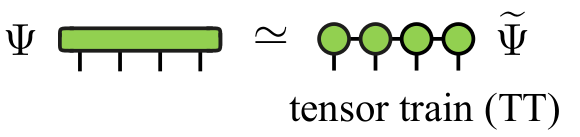

# Cross factorization of tensors: xfac


`xfac` is a c++ library (with python binding) to learn low-rank tensor train representations from a given tensor or function.
The learning is made by *tensor cross interpolation*.
Given a multidimensional function $f:\mathcal{R}^n \rightarrow \mathcal{C}$, the library can generate an accurate approximation:

$$
f(x_1,x_2,...,x_n) \approx M_1(x_1)M_2(x_2)...M_n(x_n)
$$

where $M$ are matrices. As the variables are effectively separated, some tasks like integration or sum are now very cheap.

This factorization can be relevant even for function of one variable via the so-called *quantics* representation. In quantics, each variable is replaced by its $R$ binary digits $\sigma_0,\sigma_1,...,\sigma_{R-1}$ (for instance $x=\sum^{R-1}_{r=0}\sigma_r 2^{-r}$  if $0 \le x < 1$), and then factorized: 

$$
F(\sigma_{0}\sigma_{1}...\sigma_{R-1}) \equiv f(x(\bar{\sigma})) \approx M_1(\sigma_{0})M_2(\sigma_1)...M_n(\sigma_{R-1})
$$

making explicit the possible low entanglement between different scales of the function. Potentially, quantics allows arbitrary resolution representation (by using astronomically big grids of $2^R$ points) with cost scaling linear in $R$.

As examples of applications we can mention:
1. Integration of multidimensional functions:
    - quadratures
    - quantics
2. Computation of partition functions
3. Quantics: superfast Fourier transform
4. Quantics: solving partial differential equations
5. Automatic construction of matrix product operators
6. Function optimization
7. Quantum chemistry

The orignal math papers and the implemented algorithms are referenced [here](https://doi.org/10.1103/PhysRevX.12.041018) and:

> Yuriel Núñez Fernández, Marc K. Ritter, Matthieu Jeannin, Jheng-Wei Li, Thomas Kloss, Olivier Parcollet, Jan von Delft, Hiroshi Shinaoka, and Xavier Waintal, 
> *Learning low-rank tensor train representations: new algorithms and libraries*, *in preparation*, (2024).


## Documentation

- API documentation and tutorials are kindly hosted at https://xfac.readthedocs.io/en/latest
- You can also read the code because is not big and includes comments :-)
- The documentation can be generated [locally](#building-the-documentation-locally).

### Examples

See folder `example` (for **c++**) and `notebook` (for **python**).

## Dependencies

The dependencies are **automatically satisfied** using `git submodule`. They are

- [armadillo](http://arma.sourceforge.net/) for linear algebra on matrix and 3-leg tensor. Armadillo depends on **blas**, **lapack**.
- [Catch2](https://github.com/catchorg/Catch2) for testing.
- [pybind11](https://github.com/pybind/pybind11) for python interface.
- [carma](https://github.com/RUrlus/carma) to convert armadillo objects to python numpy array.

## Installation

```
git clone https://gitlab.kwant-project.org/ttd/xfac.git
cd xfac
cmake -S . -B build -D CMAKE_BUILD_TYPE=Release
```

If you want:

* To compile the **tests**, add `-D XFAC_BUILD_TEST=ON` to  the cmake line above.

* To generate the **python** library, add `-D XFAC_BUILD_PYTHON=ON`

* To **install** the library in specific **local directory**, add `-D CMAKE_INSTALL_PREFIX=<my_local_install_directory>`

To compile and install (respectively):
```
cmake --build build -j 4
cmake --build build --target install
```
the last line is optional and may need admin rights (`sudo`) if no local directory was provided.

#### Compilation on macOS

Compilation under macOS has been tested using the `gcc` compiler. `gcc` itself can be installed with `Homebrew`.
To build `xfac` using this compiler, the two environment variables `CC` and `CXX` must point to `gcc`'s C and respectively C++ compiler binary.
Having for instance `gcc` version 13 installed, one typically needs to add
```
export CC=/usr/local/bin/gcc-13
export CXX=/usr/local/bin/g++-13
```
to the `~/.zshrc` script. Above compiler path is the standard path where
`gcc` is usually found under macOS. If `gcc` is installed in a different location or has a different version, the path must be modified accordingly.

Moreover, the `git submodule` mechanism should ensure that the other dependecies are satisfied automatically. Otherwise, if one likes to use own
libraries, one can point to them as well in the `~/.zshrc` script. For Armadillo for instance, this would look like

```
export PATH=YOUR_PATH_TO_ARMADILLOD/include:$PATH
```
where `YOUR_PATH_TO_ARMADILLOD` must be set to the correct path.


## Usage

A simple example like `integral.cpp` at `example/integral/` can be compiled directly (after building `xfac`):
```
g++ -O3 integral.cpp -std=c++17 -L../../build -lxfac -L../../build/extern/arma -larmadillo -I../../include
```
by manually specifying the path to `xfac` and `armadillo` libraries.

### With cmake

If you use `cmake` for your project, then `xfac` can be used after building without exporting any path (hopefully), by adding this to your `CMakeLists.txt`

```
find_package(xfac REQUIRED)
target_link_libraries(myTarget xfac::xfac)
```

If you experience any problem, you can try the above combined with a later call to:

```
cmake <my_stuff> -D CMAKE_INSTALL_PREFIX=<my_local_directory>
```

where `<my_local_directory>` can be `<my_path_to_xfac>/build` (then you are linking the built library) or `<my_local_install_directory>` in case you installed `xfac` on a local directory.


#### including source code

Alternatively, you can manually copy the `xfac` source code inside your project and add `xfac` as subproject in your `CMakeLists.txt`:
```
add_directory(xfac)
target_link_library(myTarget xfac::xfac)
```
Notice that the manual copy can be automatized by adding `xfac` as a `git submodule` or using `cmake FetchContent`.

#### Jupyter notebook and conda environment

If you have problems using the Jupyter notebook with the conda environment, see this [PR#7](https://github.com/tensor4all/xfac/pull/7).

## Building the documentation locally

The documentation can be build locally by running the commands given below from inside the `docs/` folder.

- First, the [Doxygen](https://doxygen.nl) documentation can be generate by typing:
```
doxygen
```
The output is generated in folder `doxygen_out/`, and includes the html version (`index.html`) and also a latex version (after `make` you will find `refman.pdf`).
The Doxygen documentation is kind of verbose and typically only an intermediate step for building the documetation via Jupyter in the second step.

- Second, the [Jupyter Book](https://jupyterbook.org/) documentation can be build by running the command
```
jupyter-book build ./
```
after running the first step with Doxygen.
The generated HTML documentation can be viewed by opening the file `_build/html/index.html` with a webbrowser.
Note that this documentation is similar to `xfac`'s online documentation, containing a more readable version of the C++ API documentation and also the
tutorial examples. The required Python packages to build the documentation in the second step can be installed by running:
```
pip3 install -r requirements.txt
```
