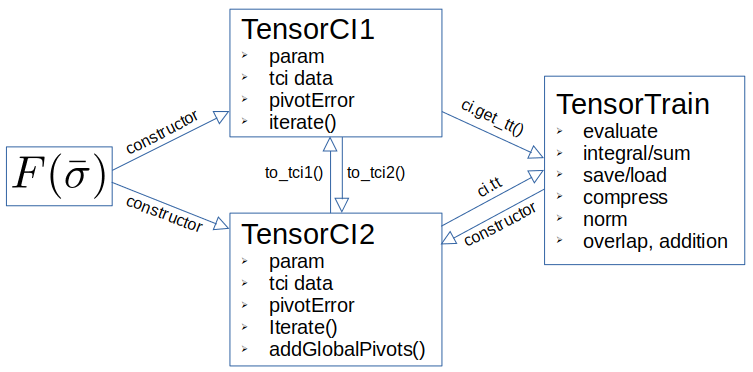

# How to get started

This section cover the `xfac` c++ API, which is very similar to it python binding `xfacpy`.
Simple use cases can be found in the [Tutorials](../tutorial-python/intro-tutorial), while 
more advanced use cases and explicit examples for the C++ API are found in the testcases, which cover the full scope of the library.
The testcases can be found in the `test` folder of the source-code repository.
A detailed description of the algorithms, which contains the mathematical definitions and further usescases in form of explicit code examples,
can be found in the main article on `xfac`. 

The main components of the library are represented below:

- [To factorize a discrete tensor function](./api1) $F$, `xfac` introduces the class `TensorCI2` (or `TensorCI1` for legacy reasons).
Its main output is the tensor train, stored in the class `TensorTrain`, which represents a list of 3-leg tensors.

- [To factorize a function on the continuous](./api2) $f:\mathcal{R}^N\rightarrow\mathcal{C}$,
`xfac` introduces the helper class `CTensorCI2`. The `CTensorCI2` is a `TensorCI2` that can be constructed from a multidimensional
function $f$ by providing also the grid of points for each component.
The main output of `CTensorCI2` is a continuous tensor train `CTensorTrain`, which can be
evaluated at any point in $\mathcal{R}^N$ including those outside the original grid.

- [To factorize a function on the continuous using quantics](./api3), `xfac` introduces the helper class `QTensorCI`.
Again, the `QTensorCI` is a `TensorCI2` that can be constructed from a multidimensional function $f$ by providing also the quantics grid.
The main output of `QTensorCI` is a quantics tensor train `QTensorTrain`, which is a cheap representation of the function $f$ that can be evaluated, and saved/loaded to file.

- As an independent topic, to build a tensor train for operators, also known as [matrix product operator](./api4), `xfac` introduces classes to collect sum of rank-1 operators, in such a way that the Hamiltonian definitions can be written easily. The posterior conversion to `TensorTrain` doesn't loss any information, similar to the SVD method for autompo.
