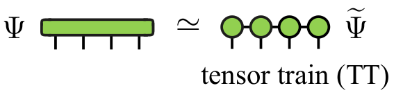

(intro)=

# Cross factorization of tensors: xfac

`xfac` is a c++ library (with python binding) to learn low-rank tensor train representations from a given tensor or function.
The learning is made by *tensor cross interpolation*.
Given a multidimensional function $f:\mathcal{R}^n \rightarrow \mathcal{C}$, the library can generate an accurate approximation:

$$
f(x_1,x_2,...,x_n) \approx M_1(x_1)M_2(x_2)...M_n(x_n)
$$

where $M$ are matrices. As the variables are effectively separated, some tasks like integration or sum are now very cheap.

This factorization can be relevant even for function of one variable via the so-called *quantics* representation. In quantics, each variable is replaced by its $R$ binary digits $\sigma_0,\sigma_1,...,\sigma_{R-1}$ (for instance $x=\sum^{R-1}_{r=0}\sigma_r 2^{-r}$  if $0 \le x < 1$), and then factorized: 

$$
F(\sigma_{0}\sigma_{1}...\sigma_{R-1}) \equiv f(x(\bar{\sigma})) \approx M_1(\sigma_{0})M_2(\sigma_1)...M_n(\sigma_{R-1})
$$

making explicit the possible low entanglement between different scales of the function. Potentially, quantics allows arbitrary resolution representation (by using astronomically big grids like $2^R$) with cost scaling linear in $R$.

As examples of applications we can mention:
1. Integration of multidimensional functions:
    - quadratures
    - quantics
2. Computation of partition functions
3. Quantics: superfast Fourier transform
4. Quantics: solving partial differential equations
5. Automatic construction of matrix product operators
6. Function optimization
7. Quantum chemistry

The orignal math papers and the implemented algorithms are referenced [here](https://doi.org/10.1103/PhysRevX.12.041018) and:

> Yuriel Núñez Fernández, Marc K. Ritter, Matthieu Jeannin, Jheng-Wei Li, Thomas Kloss, Olivier Parcollet, Jan von Delft, Hiroshi Shinaoka, and Xavier Waintal, 
> *Learning low-rank tensor train representations: new algorithms and libraries*, *in preparation*, (2024).

**Source code**

The public source code repo is: https://github.com/tensor4all/xfac

**Installation**

Install `xfac` and this documentation according to the instructions in the [README.md](https://github.com/tensor4all/xfac/blob/main/README.md) file of the code repo.

**License**

The licence is written in file [LICENSE.rst](https://github.com/tensor4all/xfac/blob/main/LICENSE.rst) of the code repo.

**Building this documentation locally**
Follow the steps described at 